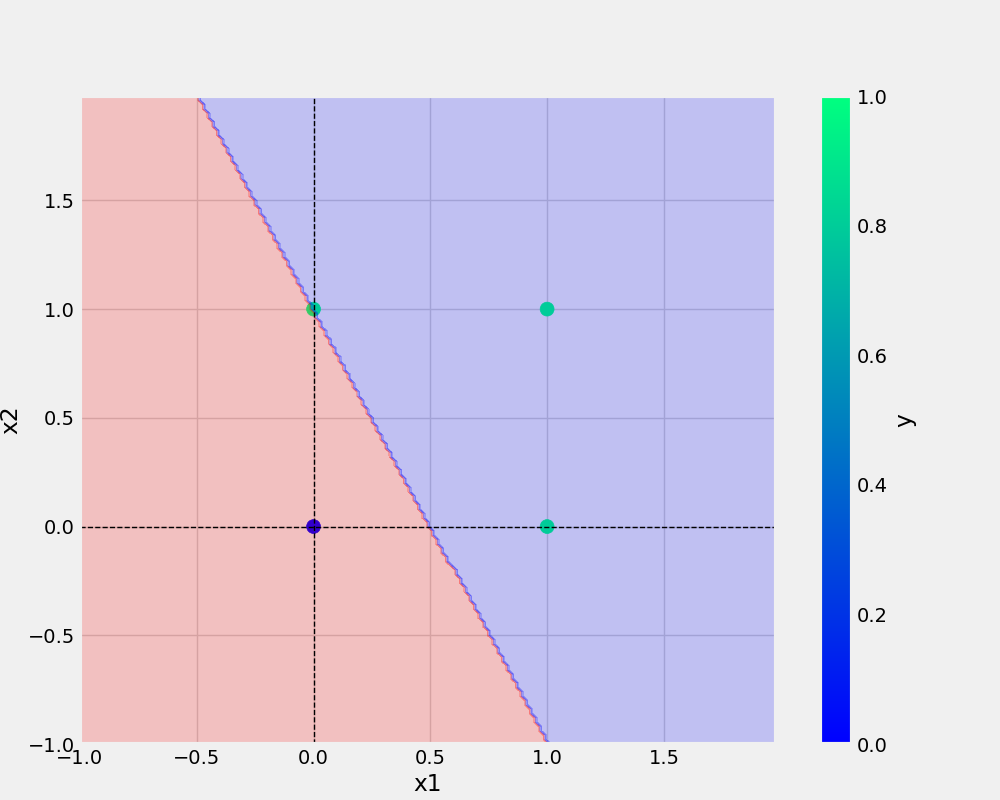

# Perceptron

## commands used
git add . && git commit -m "first commit" && git push origin main 
# used to push the commits to git repository ##  

# to move the file from other directories to working directory 
cp Research\ notebook/Demo.ipynb .

## Add image

